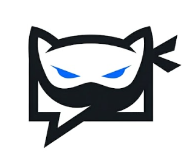

# StealthChat



> **Create a room. Share the code. Chat instantly.**

StealthChat is a premium, minimalist, and temporary real-time chat application designed for users who prioritize privacy and speed. No accounts, no logs, no traces.

## ✨ Features

- **Anonymous Communication**: No registration required. Just pick a nickname and start chatting.
- **Real-Time Messaging**: Powered by Socket.IO for instantaneous message delivery.
- **Secure Ephemeral Rooms**: Random 6-character room codes with a strict 15-participant limit.
- **Privacy Mode**: Instant interface masking with a single click or keyboard shortcut (`Ctrl + Shift + H`).
- **File Sharing**: Share images, PDFs, and documents up to 25MB directly in the chat.
- **Emoji Reactions**: Express yourself with real-time emoji reactions on any message.
- **Chat Themes**: Personalize your experience with 5 predefined premium color themes.
- **Message Search**: Easily find past messages with real-time text highlighting.
- **Smart Auto-Cleanup**: Inactive rooms are automatically deleted from server memory after 30 minutes of emptiness.
- **Multi-Platform**: Fully responsive design that feels native on both mobile and desktop.
- **Power User Features**: Keyboard shortcuts, typing indicators, and notification toggles.

## 🚀 Tech Stack

- **Frontend**: React, Vite, Tailwind CSS, Lucide Icons, Socket.IO Client.
- **Backend**: Node.js, Express, Socket.IO.
- **Testing**: Playwright for end-to-end regression testing.

## 🛠 Local Setup

### Prerequisites

- Node.js (v18 or higher)
- npm or yarn

### Installation

1. **Clone the repository**:
   ```bash
   git clone https://github.com/your-username/stealthchat.git
   cd stealthchat
   ```

2. **Install dependencies**:
   ```bash
   npm run install-all
   ```

### Running the Application

To start both the backend server and the frontend development environment simultaneously:

```bash
npm run dev
```

- **Frontend**: `http://localhost:5173`
- **Backend**: `http://localhost:5000`

## 📁 Project Structure

```text
stealthchat/
├── client/              # React frontend (Vite)
│   ├── src/
│   │   ├── components/  # Reusable UI components
│   │   ├── pages/       # Application views (Home, Room, etc.)
│   │   ├── hooks/       # Custom React hooks (useChat)
│   │   └── services/    # External services (Socket.IO)
├── server/              # Node.js backend (Express)
│   ├── src/
│   │   ├── socket/      # Socket.IO event handlers
│   │   └── utils/       # Server-side helper functions
└── README.md            # You are here!
```

## 🗺 Future Roadmap

- [ ] End-to-end encryption for all messages.
- [ ] Voice and video calling.
- [ ] Admin controls (kick/ban users).
- [ ] Persistent rooms (optional).
- [ ] PWA support for offline installation.

## 📄 License

This project is licensed under the MIT License - see the [LICENSE](LICENSE) file for details.

---

Built with ❤️ for privacy-conscious developers.
